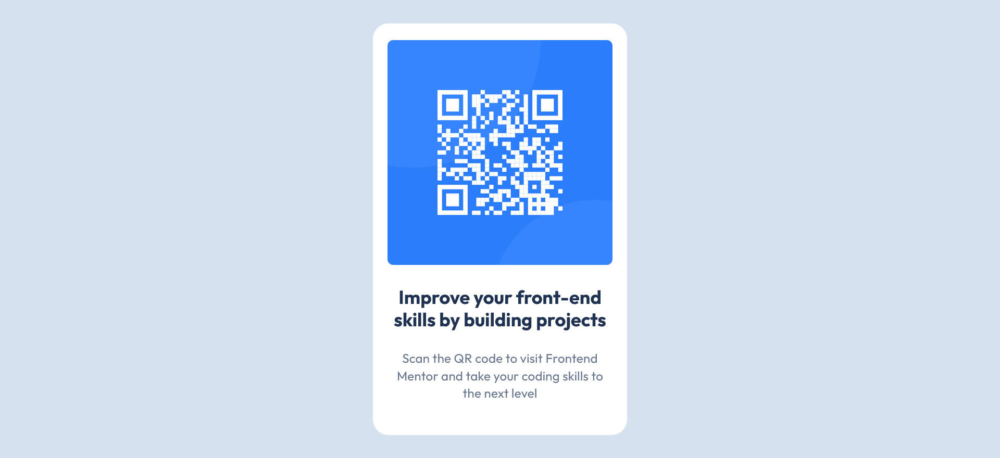

# Frontend Mentor - QR code component solution

This is a solution to the [QR code component challenge on Frontend Mentor](https://www.frontendmentor.io/challenges/qr-code-component-iux_sIO_H). Frontend Mentor challenges help you improve your coding skills by building realistic projects. 

## Table of contents

- [Frontend Mentor - QR code component solution](#frontend-mentor---qr-code-component-solution)
  - [Table of contents](#table-of-contents)
  - [Overview](#overview)
    - [Screenshots](#screenshots)
    - [Links](#links)
  - [My process](#my-process)
    - [Built with](#built-with)
    - [What I learned](#what-i-learned)
    - [Continued development](#continued-development)

## Overview

### Screenshots

### Links

- [Solution Repo URL](https://github.com/cnrivera/qr-component)
- [Live Site URL](https://your-live-site-url.com)

## My process

### Built with

- HTML
- CSS
- Flexbox

### What I learned

This project allowed me to gain greater familiarity with Flexbox, which I often alter in existing codebases but rarely write from scratch myself.

### Continued development

In future, I'll be interested in using Flexbox to construct a more complex project that uses more of its features. Additionally, I'd like to pair it with Grid to test out best scenarios for both tools, and cases where I might like to use them together.